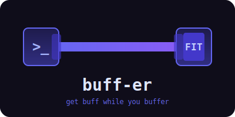

<p align="center">
  
</p>

<h1 align="center">buff-er</h1>
<p align="center">Get buff while you buffer. Exercise nudges during AI wait times.</p>

<p align="center">
  <a href="https://github.com/brennhill/buff-er/releases/latest"></a>
  <a href="https://github.com/brennhill/buff-er/actions"></a>
  <a href="https://github.com/brennhill/buff-er/blob/main/LICENSE"></a>
</p>

---

buff-er is a [Claude Code](https://docs.anthropic.com/en/docs/claude-code) hook that learns how long your commands take, then suggests quick exercises when you'll be waiting a few minutes. It also nudges you to move if you've been coding for a long stretch without a break.

## How it works

1. **Learning phase**: buff-er silently times every Bash command Claude runs (builds, tests, deploys). It groups commands by pattern (`cargo build`, `npm test`, etc.) and stores per-project timing data.

2. **Suggestion phase**: Once it has 3+ samples for a command and the 75th percentile is over 3 minutes, it suggests an exercise *before* the command runs:

```
buff-er: This usually takes ~5m. Perfect time for: Desk pushups — 10 pushups against your desk edge. Rest. Repeat.
```

3. **Break timer**: If you've been working 30+ minutes without a break (even with short commands), buff-er suggests movement at the next natural pause.

4. **Follow-up**: When a suggested command finishes:

```
buff-er: Done! Did you get that exercise in? (you know the answer)
```

## Install

### Quick install (recommended)

```bash
curl -fsSL https://raw.githubusercontent.com/brennhill/buff-er/main/install.sh | sh
buff-er install
```

### From source

```bash
go install github.com/brennhill/buff-er/cmd/buff-er@latest
buff-er install
```

### Manual download

Grab the binary for your platform from [Releases](https://github.com/brennhill/buff-er/releases/latest), put it in your PATH, then run `buff-er install`.

### Verify

```bash
buff-er doctor
```

## Uninstall

```bash
buff-er uninstall
```

## Configuration

Create `~/.config/buff-er/config.toml` to customize:

```toml
enabled = true
min_trigger_minutes = 3.0    # minimum estimated time to trigger suggestion
break_cooldown_minutes = 30  # minutes between break suggestions

# Override the default exercise catalog
[[exercises]]
name = "Stretch break"
description = "Stand up and stretch for 2 minutes"
min_minutes = 1
max_minutes = 3
category = "stretch"
```

If no config file exists, buff-er uses sensible defaults with 18 built-in exercises across stretch, strength, and movement categories.

## How it stores data

- **Timing data**: `~/.local/share/buff-er/{project-hash}/timings.db` (SQLite)
- **Config**: `~/.config/buff-er/config.toml`
- **Pending state**: `$TMPDIR/buff-er-{session}/` (cleaned up automatically)

Timing data uses a 3-day sliding window — old records are pruned automatically.

## Design principles

- **Never blocks the AI** — the hook is passive and always exits 0
- **Learns, doesn't guess** — no suggestions until it has real timing data for your project
- **Fails silently** — errors show a brief message but never break your workflow
- **Single binary** — no runtime dependencies, no node_modules, no venv
